# Intervenção Humana e CSAT na Plataforma AWSales

Referência completa para configurar e explicar os recursos de Intervenção Humana e Avaliação de Satisfação (CSAT) em qualquer campanha da plataforma. Essas configurações ficam no painel da campanha, não no checkpoint nem nas FAQs.

---

## 1. Intervenção Humana

Permite que atendentes humanos participem do atendimento quando necessário. O sistema gerencia a fila de tickets, monitora tempos de resposta e garante que nenhum lead fique sem atendimento.

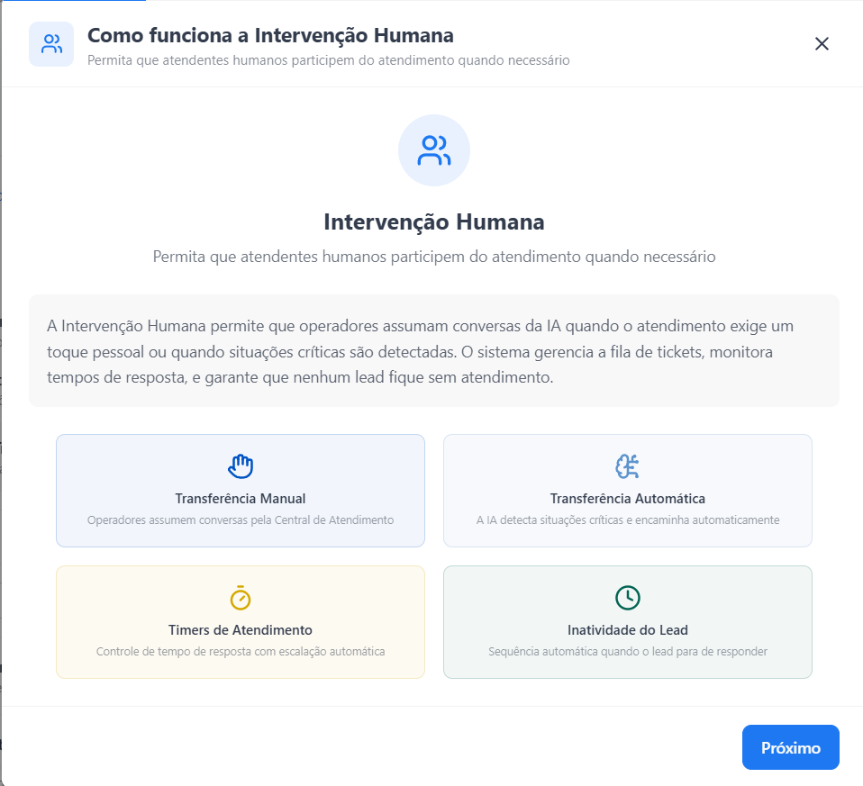

São quatro mecanismos que podem ser ligados de forma independente: Transferência Manual, Transferência Automática, Timers de Atendimento e Inatividade do Lead. Existe ainda um quinto comportamento dependente dos timers: a Redistribuição de Tickets.

### 1.1 Transferência Manual

Operadores conseguem visualizar conversas em andamento na Central de Atendimento e assumir o controle quando julgarem necessário. Ideal para casos que exigem empatia, negociação ou conhecimento especializado.

Fluxo:
1. Lead conversa com a IA normalmente.
2. Operador identifica necessidade de intervir pela Central de Atendimento.
3. IA é pausada e operador assume.
4. Operador encerra e a IA pode retomar.

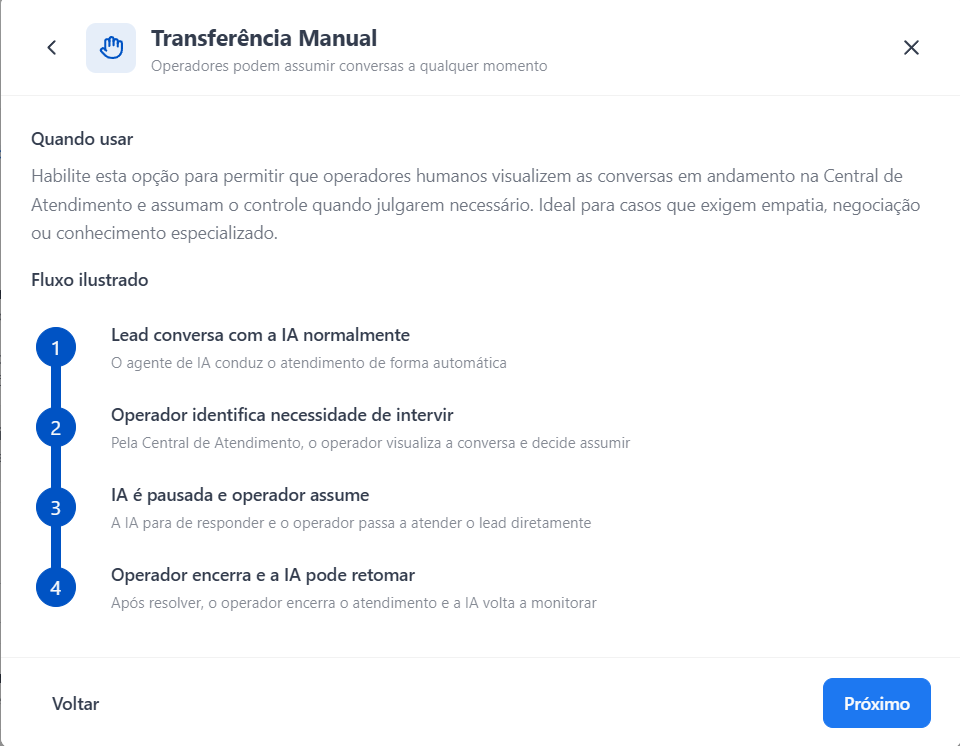

### 1.2 Transferência Automática (2.0)

A IA analisa cada resposta antes de enviar. Quando detecta uma situação crítica, transfere a conversa sozinha para a fila humana.

Fluxo:
1. IA prepara uma resposta para o lead.
2. Gatilho é ativado (lead pediu humano, IA com baixa confiança, linguagem hostil, entre outros).
3. Conversa enviada para a fila da equipe configurada.
4. Operador assume o atendimento já com o contexto completo.

Os gatilhos são configuráveis individualmente. A plataforma oferece 9 gatilhos no total e o CS pode escolher quais ligar por campanha.

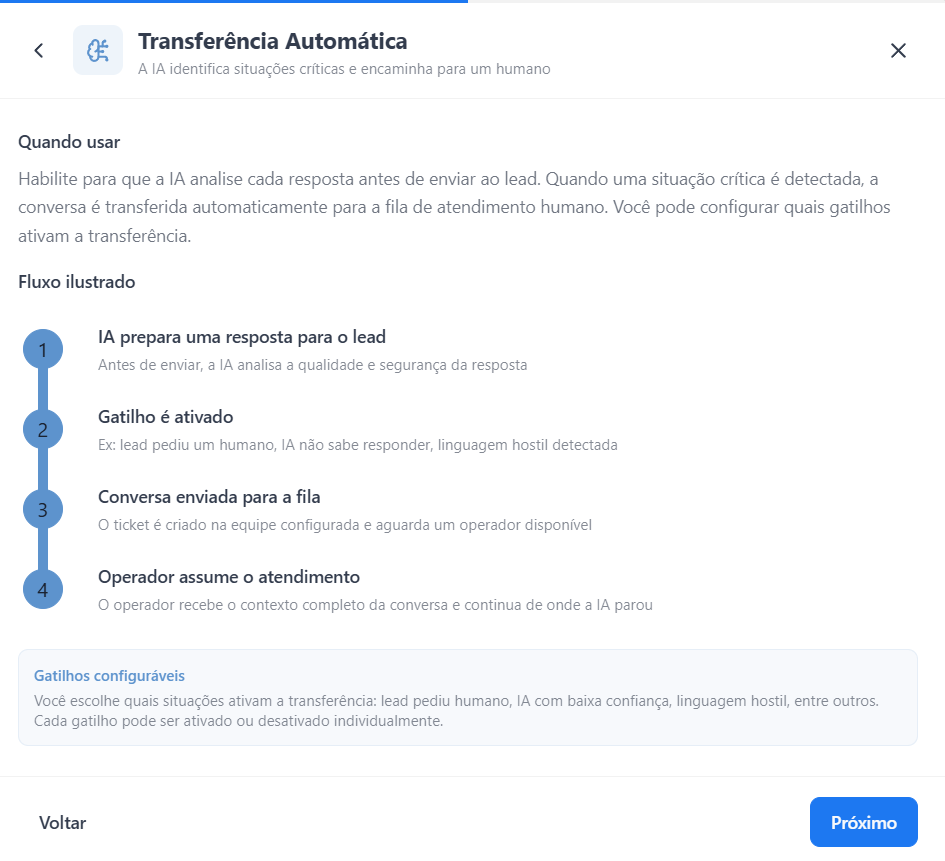

### 1.3 Inatividade do Lead

Aplica-se durante o atendimento HUMANO. Se o lead para de responder, o sistema envia mensagens automáticas para tentar retomar o contato. Ao final da sequência, o ticket é encerrado automaticamente.

Fluxo:
1. Lead para de responder.
2. Após o tempo configurado, sistema envia primeira mensagem automática.
3. Sequência continua se ele não responder, em intervalos configurados.
4. Ticket encerrado automaticamente ao final da sequência.

Se o lead responder em qualquer momento, a sequência é interrompida e o operador retoma o atendimento normalmente.

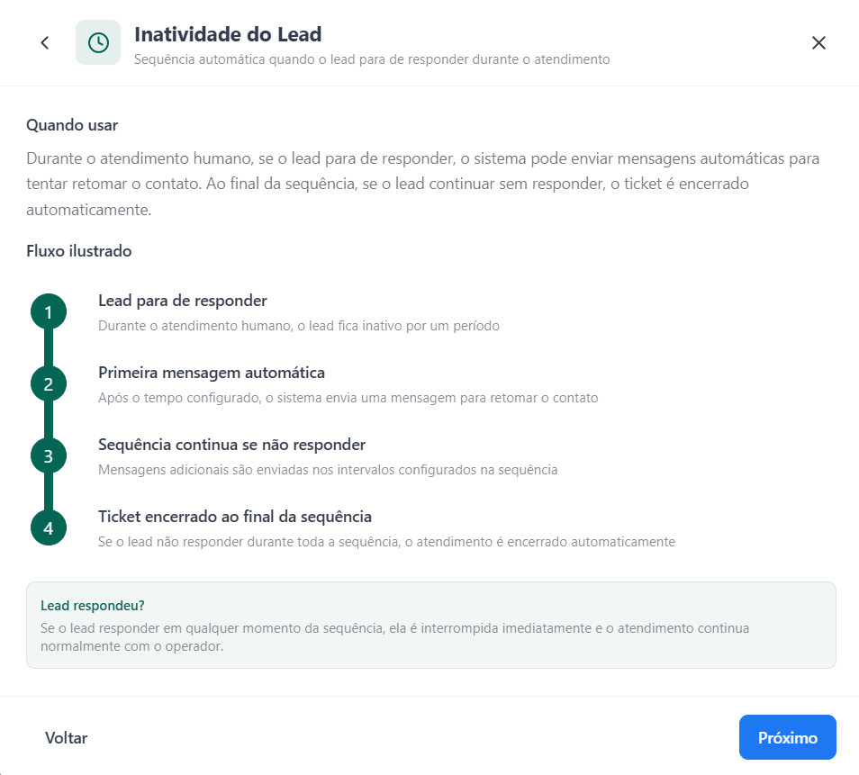

### 1.4 Timers de Atendimento

Garantem que nenhum lead fique esperando muito tempo o operador. Define-se o tempo máximo que um operador pode ficar sem responder. Se for excedido, sistema escala prioridade e reatribui o ticket.

Fluxo:
1. Operador recebe o ticket. Timer começa a contar a partir da última mensagem do lead.
2. Tempo de resposta excedido sem manifestação do operador.
3. Prioridade escalada (opcional) para chamar atenção.
4. Ticket reatribuído. Operador é desatribuído e o ticket volta para a fila.

Tempo configurável de 5 minutos a 30 dias.

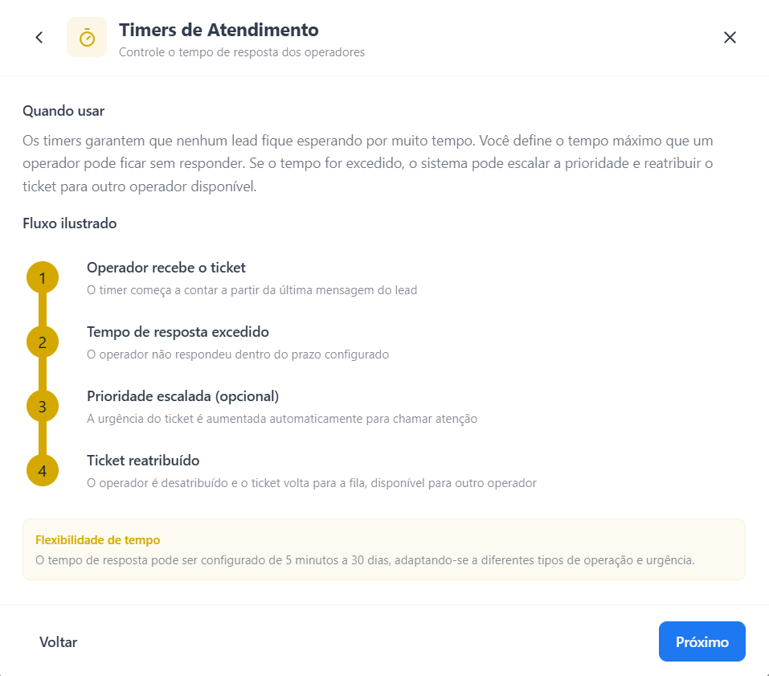

### 1.5 Redistribuição de Tickets (depende de Timers)

Quando o timer expira, o operador é temporariamente suspenso. Se o lead enviar uma nova mensagem com o operador ainda suspenso, o ticket é redistribuído automaticamente para outro operador da equipe.

Fluxo:
1. Operador suspenso por inatividade.
2. Lead envia nova mensagem.
3. Ticket redistribuído automaticamente para outro operador disponível.
4. Novo operador assume com todo o contexto da conversa preservado, sem o lead perceber a troca.

Se nenhum operador estiver ativo, o ticket permanece com o atual até alguém ficar disponível.

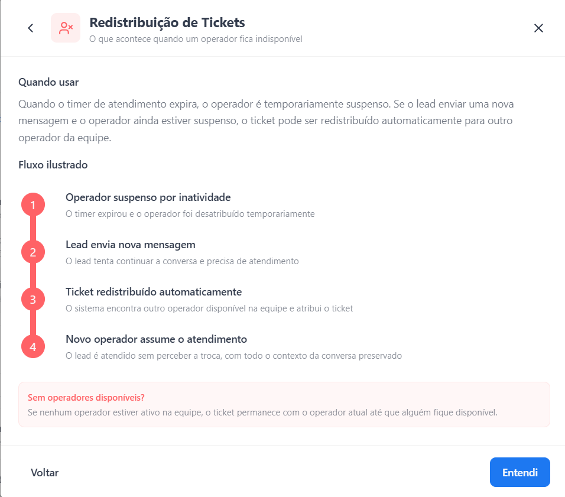

### 1.6 Demais campos da configuração

- Equipe de Destino: equipe que recebe os tickets quando uma conversa é transferida (manual ou auto).
- Os recursos podem ser combinados: ligar Manual sem ligar Automática (ou vice-versa) é válido.
- Para campanhas de suporte, a recomendação padrão é Manual + Automática 2.0 ligados.

---

## 2. CSAT (Avaliação de Satisfação)

Coleta automática de satisfação ao final de cada atendimento de suporte. Sempre ativo em campanhas de suporte e não pode ser desativado. O lead recebe duas perguntas: "Conseguimos resolver?" (Sim/Não) e depois "De 1 a 5, como avalia o atendimento?". Respostas vão direto para os relatórios da campanha.

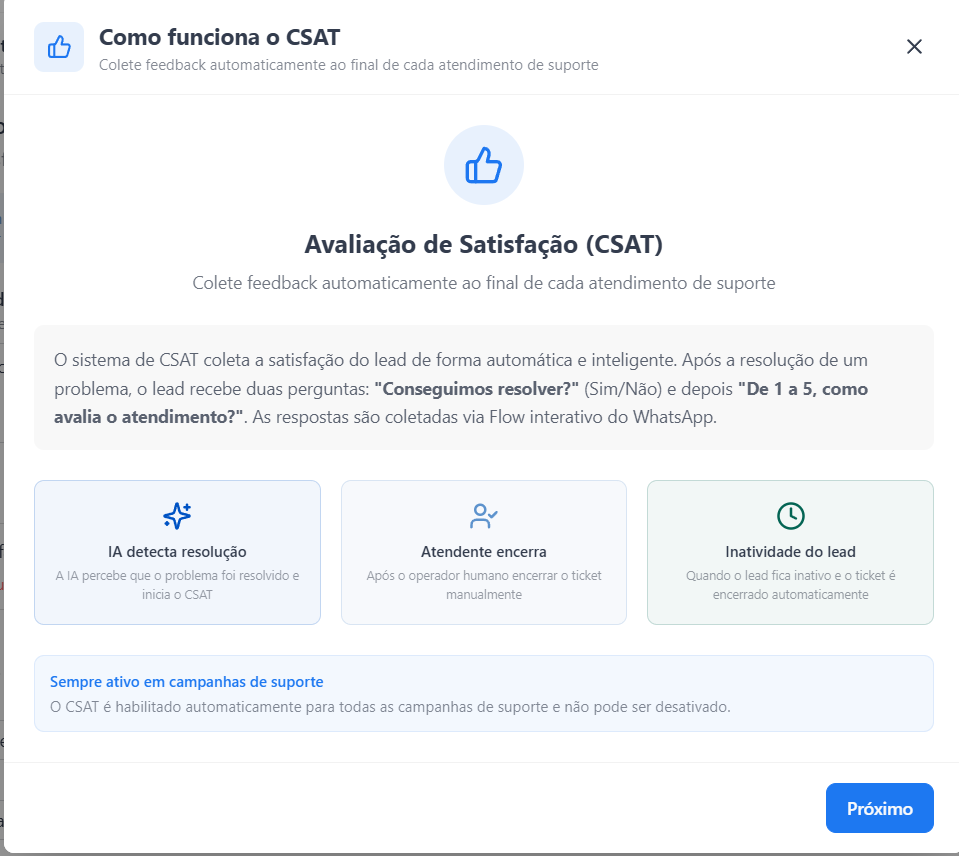

São três cenários que disparam o CSAT: IA detecta resolução, Atendente encerra o ticket, ou Encerramento por inatividade.

### 2.1 Template com Flow Interativo

O sistema cria automaticamente um Flow do WhatsApp com duas telas (resolução Sim/Não + nota 1-5). O lead responde nos botões, sem digitar.

Quando a janela de 24h da Meta está aberta, a pergunta é enviada direto no chat. Quando está fechada, é necessário um template aprovado pela Meta com botão que abre o Flow. Sem template aprovado, o CSAT não é coletado fora da janela de 24h.

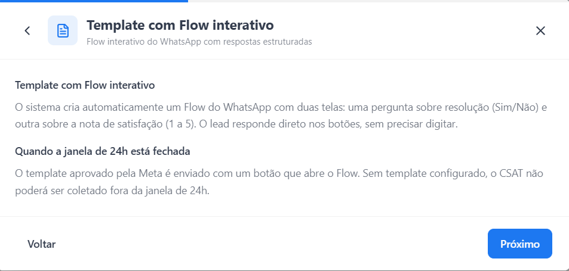

### 2.2 Cenário 1: IA detecta resolução

A IA monitora a conversa e identifica sinais de resolução (lead agradeceu, confirmou que funcionou, "deu certo, obrigado", etc.). Aciona o CSAT automaticamente.

Fluxo:
1. Lead sinaliza resolução ("Resolveu sim", "Era isso mesmo, valeu").
2. IA decide o momento certo e envia a primeira pergunta automaticamente.
3. Lead responde no Flow ou por texto. Se "Sim", pede nota 1-5. Se "Não", registra como não resolvido.
4. Avaliação salva nos relatórios.

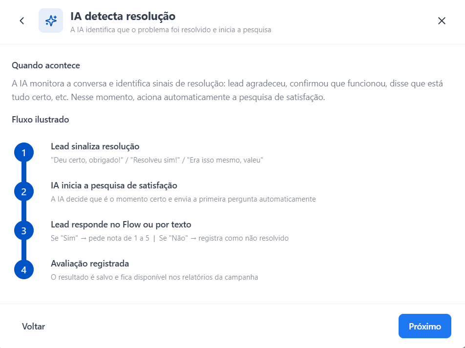

### 2.3 Cenário 2: Atendente encerra o ticket

Quando Intervenção Humana está habilitada e o atendente clica em "Encerrar Atendimento", o sistema aguarda o delay configurado antes de enviar o CSAT. O delay evita que a pesquisa chegue abruptamente após o encerramento.

Fluxo:
1. Atendente clica "Encerrar Atendimento".
2. Sistema aguarda o delay configurado (10 segundos a 5 minutos).
3. Envia a pesquisa de satisfação (template com botão para abrir o Flow).
4. Coleta a resposta via Flow ou por texto livre.

Esse cenário e o slider de delay só ficam disponíveis quando Intervenção Humana está ativa.

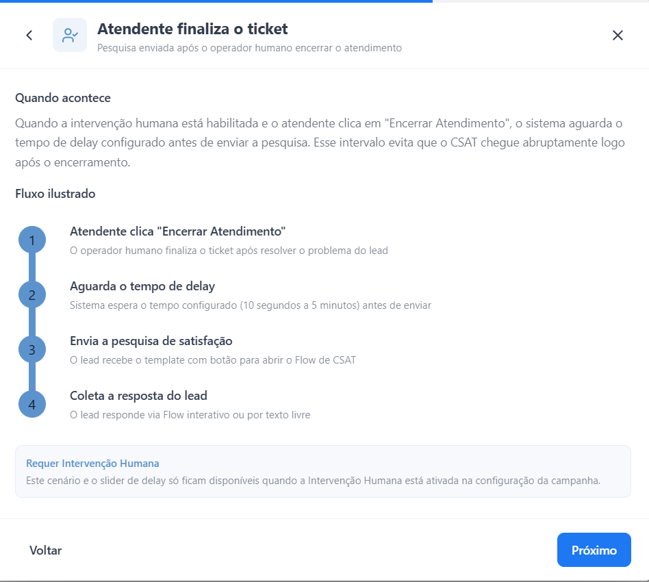

### 2.4 Cenário 3: Encerramento por inatividade

Durante atendimento humano, se o lead fica inativo e o ticket é encerrado automaticamente pela sequência de inatividade, o CSAT é disparado depois do fechamento.

Fluxo:
1. Lead para de responder durante atendimento humano.
2. Ticket encerrado automaticamente pela sequência de inatividade.
3. Pesquisa de satisfação enviada.
4. Coleta da resposta via Flow ou texto livre.

Só se aplica quando Intervenção Humana está ativada (depende de um atendente ter assumido a conversa previamente).

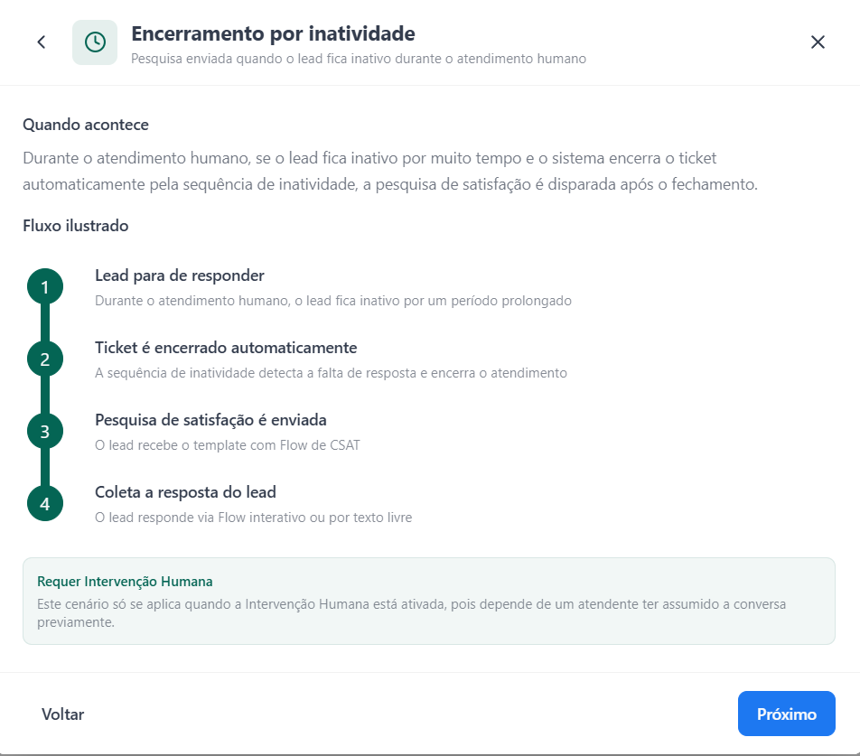

### 2.5 Mudança de assunto durante o CSAT

Após enviar a pesquisa, o lead pode responder com um problema novo em vez de avaliar. A IA está preparada para esse cenário.

Fluxo:
1. Pesquisa enviada (template com Flow ou pergunta direta).
2. Lead responde com outro assunto ("Na verdade, tenho outro problema", "Preciso de ajuda com outra coisa").
3. CSAT encerrado e fluxo conversacional normal retomado.
4. Novo atendimento segue o tipo de sessão. Sessão IA, atende via IA. Sessão ticket, aguarda operador.

Um agente classificador interno decide se a resposta é sobre o CSAT ou um novo assunto. O lead nunca precisa responder a pesquisa antes de ser atendido.

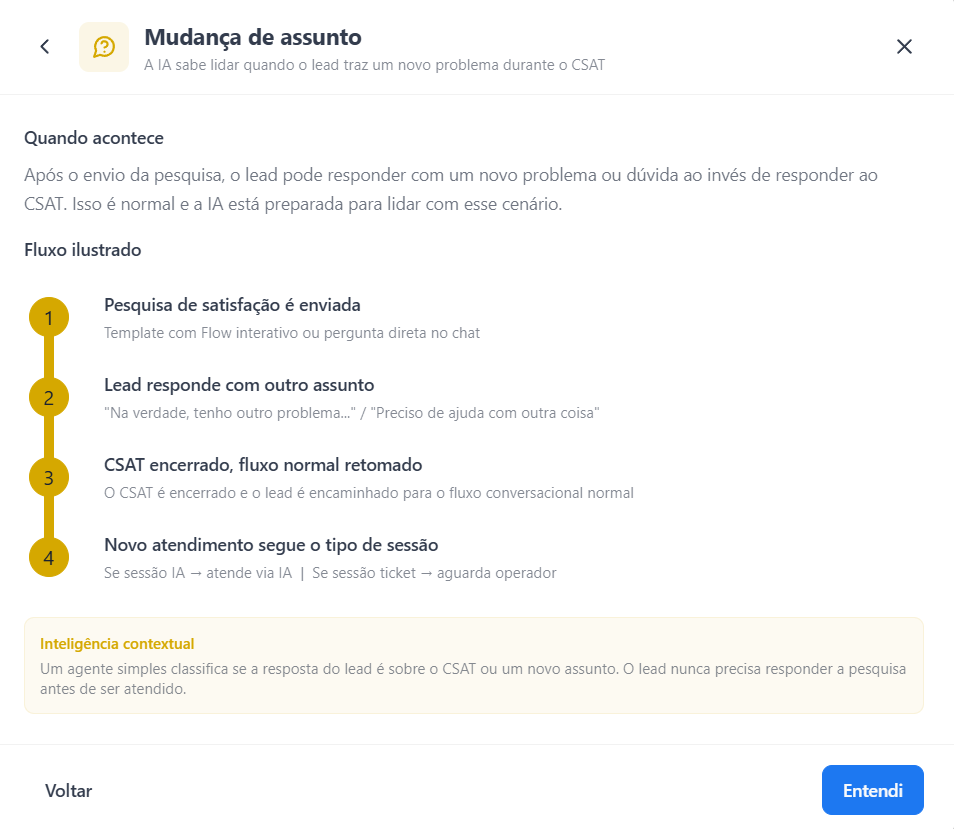

### 2.6 Campos de configuração do CSAT

- Mensagem introdutória do template: texto que aparece no template fora da janela de 24h, com botão para abrir o Flow.
- Template de CSAT: template aprovado pela Meta para reabrir conversa fora da janela. Pode ficar com status "Rejeitado" caso a mensagem precise de ajuste.
- Personalizar mensagens (usadas quando o lead responde por texto, fora do Flow):
  - Pergunta de resolução
  - Pergunta de nota
  - Mensagem se não resolveu
  - Mensagem de agradecimento
- Delay após encerramento humano: tempo de espera entre o encerramento do operador e o envio da pesquisa (10 segundos a 5 minutos).

---

## 3. A Visão do Cliente (Operador) na Central de Atendimento

O cliente operador NÃO vê todas as conversas em andamento. Na Central de Atendimento da plataforma, ele tem acesso somente a duas abas: Fila e Meus Atendimentos.

### 3.1 Aba "Fila"

Mostra as conversas que estão na fila aguardando alguém da equipe assumir. Aparecem agrupadas em "Aguardando Atendimento" (ainda sem operador atribuído) e "Em Atendimento" (já assumidas por algum operador da equipe). O operador pode pesquisar por nome ou telefone.

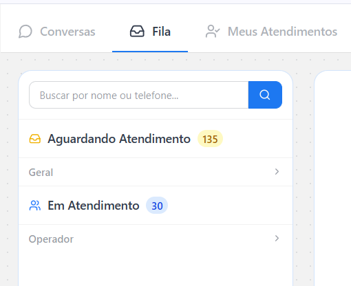

### 3.2 Aba "Meus Atendimentos"

Mostra apenas as conversas atribuídas àquele operador específico, divididas entre "Aguardando" (lead esperando resposta dele) e "Respondidos" (já respondeu, aguardando lead).

Importante: a aba "Conversas" (que mostra todas as conversas em andamento, inclusive as que a IA está atendendo sozinha) NÃO está disponível na visão do cliente operador. Isso significa que o cliente só age sobre o que a IA já transferiu (manual ou automaticamente). Ele não consegue interromper proativamente uma conversa que ainda está com a IA.

Para ativar Transferência Manual em uma campanha onde o cliente não tem a aba "Conversas", a única forma de o operador "puxar" uma conversa é via Transferência Automática (gatilhos da IA) ou via botão de transferência dentro do próprio ticket que já entrou na fila.

---

## 4. Como Aplicar em Novas Campanhas

Padrão recomendado para campanhas de suporte:
- Transferência Manual: ON.
- Transferência Automática 2.0: ON, com pelo menos os gatilhos de "lead pediu humano", "IA não sabe responder" e "linguagem hostil" ativos.
- Equipe de Destino: definir conforme a estrutura do cliente (Geral, Suporte Técnico, Comercial, etc.).
- Timers de Atendimento: ligar quando o cliente tiver SLA definido. Manter desligado em operações com poucos operadores ou volume baixo.
- Redistribuir ticket se operador suspenso: ligar junto com Timers, nunca sozinho.
- Sequência de inatividade do lead: ligar para evitar tickets parados eternamente.
- CSAT: já é sempre ativo. Garantir que o template Meta esteja aprovado antes de subir a campanha.

Itens que NÃO entram no checkpoint nem nas FAQs:
- Configurações de Intervenção Humana e CSAT são feitas no painel da campanha.
- O comportamento de handoff é mencionado no checkpoint apenas como instrução comportamental ("fazer handoff humano após coletar e-mail"), nunca como configuração técnica.
- Mensagens automáticas do CSAT (pergunta de resolução, nota, agradecimento) são preenchidas direto no painel, não em FAQ.
