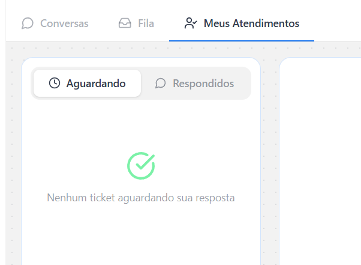

---
pdf_options:
  format: A4
  margin: 16mm 15mm 18mm 15mm
  printBackground: true
  displayHeaderFooter: false
css: |
  @page { size: A4; margin: 16mm 15mm 18mm 15mm; }

  * { box-sizing: border-box; }

  body {
    font-family: Inter, -apple-system, BlinkMacSystemFont, "Segoe UI", Roboto, Arial, sans-serif;
    color: #172033;
    line-height: 1.55;
    font-size: 10.5pt;
    background: #ffffff;
  }

  h1, h2, h3, p { break-inside: avoid; }

  h1 {
    color: #ffffff;
    font-size: 27pt;
    line-height: 1.08;
    margin: 0 0 10px 0;
    letter-spacing: -0.4px;
  }

  h2 {
    color: #0b3d91;
    font-size: 15pt;
    margin: 28px 0 10px 0;
    padding-top: 2px;
    border-top: 1px solid #dbe7f6;
  }

  h3 {
    color: #172033;
    font-size: 12pt;
    margin: 18px 0 8px 0;
  }

  p { margin: 7px 0; }

  ul, ol {
    margin: 8px 0 10px 0;
    padding-left: 20px;
  }

  li { margin: 5px 0; }

  strong { color: #0b3d91; }

  img {
    width: 100%;
    max-width: 100%;
    border: 1px solid #dbe4f0;
    border-radius: 10px;
    box-shadow: 0 10px 26px rgba(15, 23, 42, 0.11);
    margin: 12px 0 6px 0;
    display: block;
  }

  em.caption {
    display: block;
    color: #64748b;
    font-size: 9pt;
    margin: 0 0 15px 0;
    font-style: normal;
  }

  .cover {
    background: #0b3d91;
    color: #ffffff;
    border-radius: 12px;
    padding: 28px 30px 26px 30px;
    margin: 0 0 24px 0;
    min-height: 160px;
    border-left: 8px solid #16a085;
  }

  .eyebrow {
    display: inline-block;
    color: #dff8ff;
    font-size: 8.5pt;
    font-weight: 700;
    letter-spacing: 1.2px;
    text-transform: uppercase;
    margin-bottom: 18px;
  }

  .subtitle {
    color: #e9f7ff;
    font-size: 12pt;
    max-width: 520px;
    margin: 0;
  }

  .intro {
    border: 1px solid #dbe7f6;
    background: #f7fbff;
    border-radius: 14px;
    padding: 15px 18px;
    margin: 0 0 18px 0;
  }

  .grid {
    display: grid;
    grid-template-columns: 1fr 1fr;
    gap: 12px;
    margin: 14px 0 18px 0;
  }

  .card {
    border: 1px solid #dbe4f0;
    border-radius: 12px;
    background: #ffffff;
    padding: 14px 15px;
    min-height: 116px;
  }

  .card strong {
    display: block;
    font-size: 11.5pt;
    margin-bottom: 5px;
  }

  .tag {
    display: inline-block;
    background: #e8f3ff;
    border: 1px solid #bfdbfe;
    color: #0b3d91;
    border-radius: 999px;
    padding: 3px 9px;
    font-size: 8.5pt;
    font-weight: 700;
    margin: 2px 6px 8px 0;
  }

  .callout {
    background: #ecfdf5;
    border: 1px solid #a7f3d0;
    border-left: 5px solid #059669;
    padding: 13px 16px;
    border-radius: 10px;
    margin: 16px 0;
    font-size: 10pt;
  }

  .callout strong { color: #065f46; }

  .note {
    background: #fff7ed;
    border: 1px solid #fed7aa;
    border-left: 5px solid #f97316;
    padding: 13px 16px;
    border-radius: 10px;
    margin: 16px 0;
    font-size: 10pt;
  }

  .note strong { color: #9a3412; }

  .steps {
    counter-reset: step;
    padding-left: 0;
    margin: 12px 0 4px 0;
  }

  .steps li {
    list-style: none;
    counter-increment: step;
    position: relative;
    break-inside: avoid;
    padding: 11px 13px 11px 43px;
    margin: 8px 0;
    background: #f8fafc;
    border: 1px solid #e2e8f0;
    border-radius: 12px;
  }

  .steps li:before {
    content: counter(step);
    position: absolute;
    left: 13px;
    top: 12px;
    width: 20px;
    height: 20px;
    border-radius: 999px;
    background: #0b3d91;
    color: white;
    font-size: 8.5pt;
    font-weight: 800;
    text-align: center;
    line-height: 20px;
  }

  .question-box {
    border: 1px solid #dbe4f0;
    border-radius: 12px;
    padding: 13px 15px;
    margin: 10px 0;
    background: #ffffff;
  }

  .question-box span {
    display: inline-block;
    background: #eef6ff;
    color: #0b3d91;
    border-radius: 999px;
    padding: 3px 8px;
    font-size: 8.5pt;
    font-weight: 700;
    margin-bottom: 6px;
  }

  .page-break { page-break-before: always; }

  .mini-list {
    background: #f8fafc;
    border: 1px solid #e2e8f0;
    border-radius: 12px;
    padding: 12px 16px;
    margin: 12px 0;
  }
---

  
Mini tutorial · Suporte

  <h1>Intervenção Humana e CSAT</h1>
  
Como operar o handoff para atendimento humano e como funciona a pesquisa de satisfação automática da campanha.

Foram ativados dois recursos na campanha de suporte da <strong>Falcão das Milhas</strong>: a Intervenção Humana, para que o time assuma conversas quando necessário, e o CSAT, para coletar satisfação automaticamente ao final do atendimento.

Intervenção Humana ativa
IA pausada durante atendimento humano
CSAT automático

## 1. O que foi ativado

  

    <strong>Intervenção Humana</strong>
    Permite que operadores assumam conversas da IA quando o atendimento exige um toque humano.
  

  

    <strong>CSAT</strong>
    Ao final do atendimento, o lead recebe automaticamente uma pesquisa simples de satisfação pelo WhatsApp.
  

Na prática, a IA continua atendendo normalmente. O time entra quando um operador decide assumir manualmente ou quando a IA detecta um cenário crítico e encaminha a conversa para atendimento humano.

## 2. Como a conversa chega ao time

Existem dois caminhos para uma conversa sair da IA e cair na fila da equipe:

  

    <strong>Transferência manual</strong>
    O operador pode visualizar conversas pela Central de Atendimento e assumir quando identificar necessidade de intervenção.
  

  

    <strong>Transferência automática</strong>
    Antes de responder, a IA analisa segurança e qualidade. Se algum gatilho configurado for ativado, a conversa é enviada para a fila.
  

Quando isso acontece, o ticket fica vinculado à equipe de destino configurada e um operador pode dar continuidade com o contexto da conversa.

  <strong>Ponto principal:</strong> enquanto o atendimento humano estiver ativo, a IA fica pausada naquela conversa. Depois que o operador encerra o atendimento, a IA pode voltar a monitorar e atender normalmente.

## 3. Onde o operador atende

O atendimento acontece na <strong>Central de Atendimento</strong>. Ela possui duas abas principais.

### Aba Fila

Mostra as conversas disponíveis para a equipe, incluindo tickets aguardando atendimento e atendimentos em andamento. É a visão principal para acompanhar a fila.

<em class="caption">Conversas em "Aguardando Atendimento" estão livres para um operador assumir.</em>

### Aba Meus Atendimentos

Mostra apenas os tickets atribuídos ao operador logado. É a visão ideal para acompanhar os próprios atendimentos durante a rotina.

<em class="caption">Use esta aba para continuar e encerrar os atendimentos que já estão sob sua responsabilidade.</em>

  <strong>Importante:</strong> ao assumir uma conversa, o operador recebe o histórico e continua de onde a IA parou. Durante esse período, a IA não responde pelo operador.

## 4. Passo a passo do atendimento

<ol class="steps">
  <li><strong>Acompanhe a Central.</strong> Abra a aba <strong>Fila</strong> para ver conversas disponíveis, aguardando atendimento ou em andamento.</li>
  <li><strong>Assuma quando necessário.</strong> O operador pode assumir manualmente ou receber um ticket que a IA encaminhou por gatilho automático.</li>
  <li><strong>Atenda o lead.</strong> A partir desse momento, a IA fica pausada e o operador conversa diretamente com o lead.</li>
  <li><strong>Resolva a solicitação.</strong> Siga normalmente com a orientação, correção ou encaminhamento necessário.</li>
  <li><strong>Encerre o atendimento.</strong> Quando finalizar, clique em <strong>Encerrar Atendimento</strong> dentro do ticket.</li>
  <li><strong>A pesquisa é enviada automaticamente.</strong> Após o encerramento pelo operador, o CSAT é disparado com delay de 5 minutos.</li>
</ol>

## 5. Recursos de controle da fila

A Intervenção Humana também possui recursos para proteger a operação quando a fila cresce ou quando o lead fica sem resposta.

  

    <strong>Timers de atendimento</strong>
    Controlam o tempo de resposta do operador. Se o prazo configurado for excedido, o sistema pode aumentar a urgência e reatribuir o ticket.
  

  

    <strong>Inatividade do lead</strong>
    Permite enviar mensagens automáticas quando o lead para de responder durante o atendimento humano.
  

  

    <strong>Redistribuição de tickets</strong>
    Se um operador ficar indisponível, o ticket pode ser redistribuído para outro operador ativo da equipe.
  

  

    <strong>Gatilhos configuráveis</strong>
    A transferência automática pode considerar pedido de humano, linguagem hostil, baixa confiança, resposta "não sei" e outros critérios.
  

  <strong>Observação:</strong> esses controles dependem da configuração da campanha. Quando estiverem desligados, o fluxo principal continua sendo assumir, atender e encerrar o ticket normalmente.

## 6. Como funciona o CSAT

A pesquisa de satisfação é automática e pode ser iniciada em três situações:

- Quando a IA entende que o problema foi resolvido na conversa.
- Quando o operador clica em <strong>Encerrar Atendimento</strong>.
- Quando uma regra configurada encerra o ticket por inatividade durante o atendimento humano.

O lead recebe duas perguntas, ambas com botões dentro do WhatsApp:

  Pergunta 1 
  <strong>Conseguimos resolver seu problema?</strong> 
  Opções: Sim / Não

  Pergunta 2 
  <strong>De 1 a 5, como você avalia nosso atendimento?</strong> 
  Opções: nota de 1 a 5

  Se o lead mandar uma nova dúvida em vez de responder à pesquisa, a IA entende o contexto, encerra o CSAT e volta a atender normalmente.

## 7. Boas práticas para o time

- <strong>Acompanhe a fila:</strong> use a aba <strong>Fila</strong> para identificar conversas aguardando atendimento ou tickets que precisam de atenção.
- <strong>Assuma com contexto:</strong> antes de responder, leia o histórico da conversa para continuar de onde a IA parou.
- <strong>Encerre ao finalizar:</strong> quando o caso estiver resolvido, clique em <strong>Encerrar Atendimento</strong> para liberar o fluxo automático de pesquisa.

## 8. Em uma frase

O time deve acompanhar a <strong>Central de Atendimento</strong>, assumir as conversas que precisam de intervenção humana, resolver o caso, encerrar o ticket e deixar que o CSAT seja enviado automaticamente.
